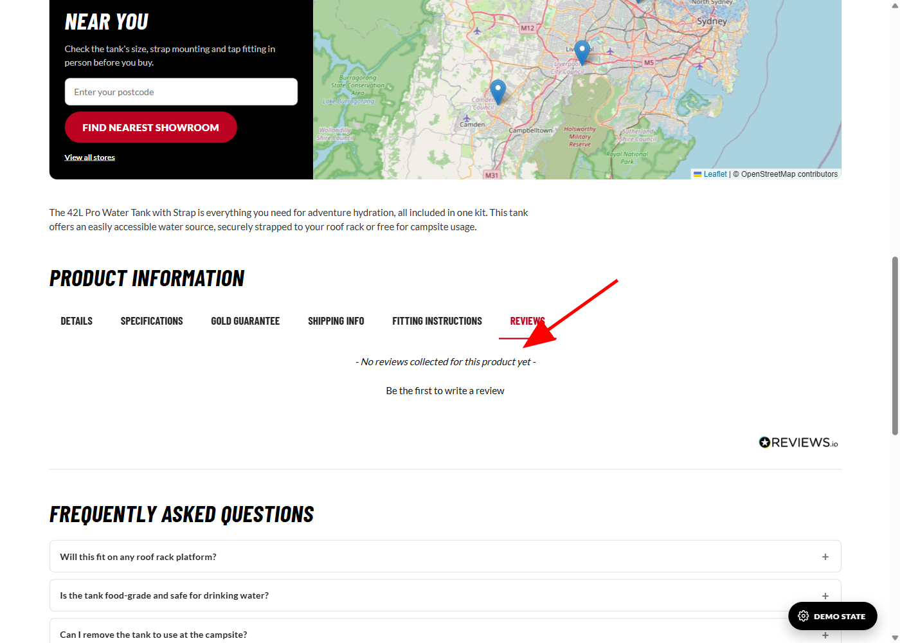
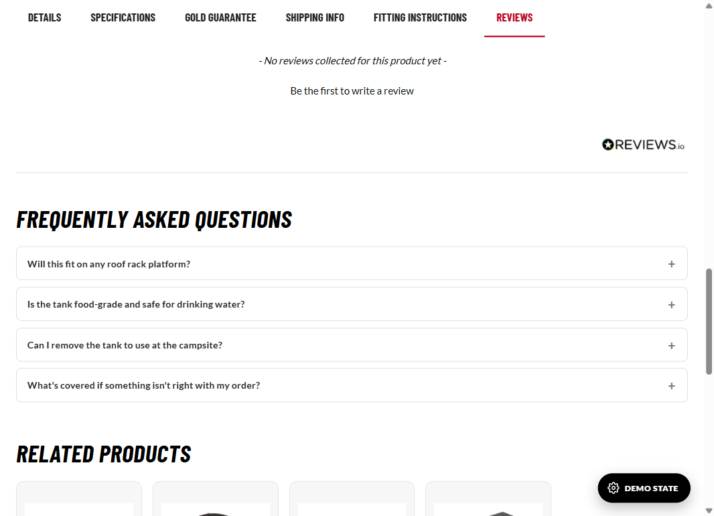
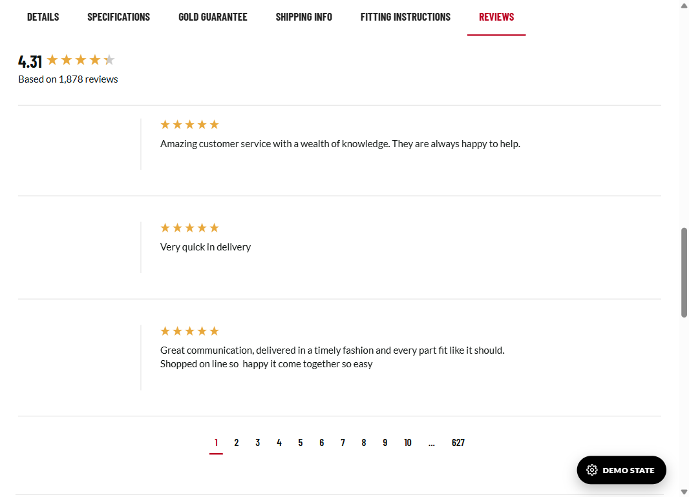
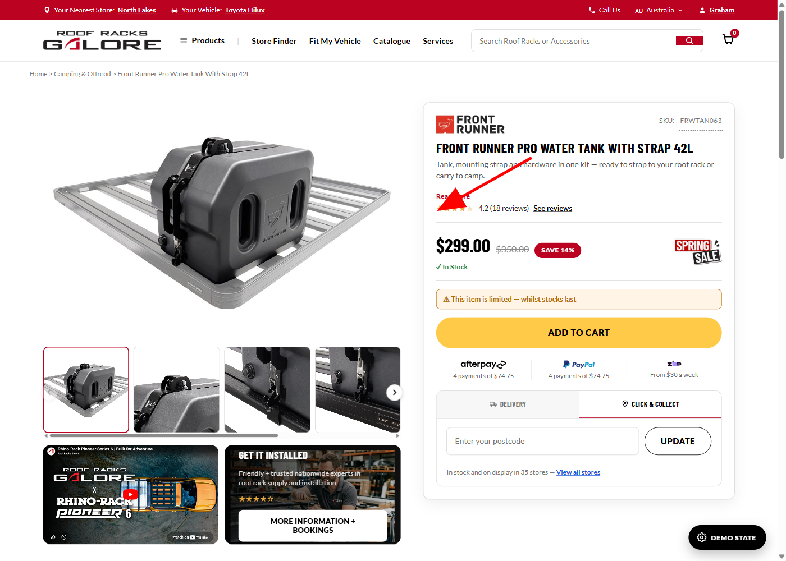
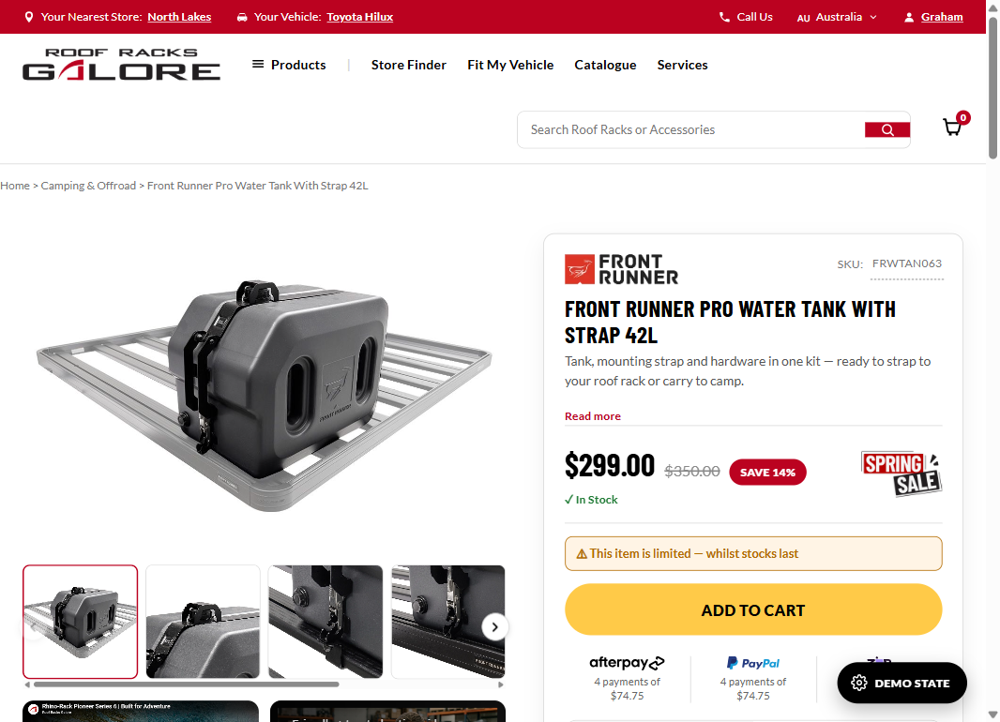
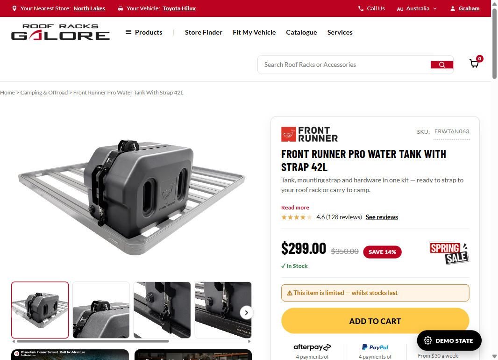
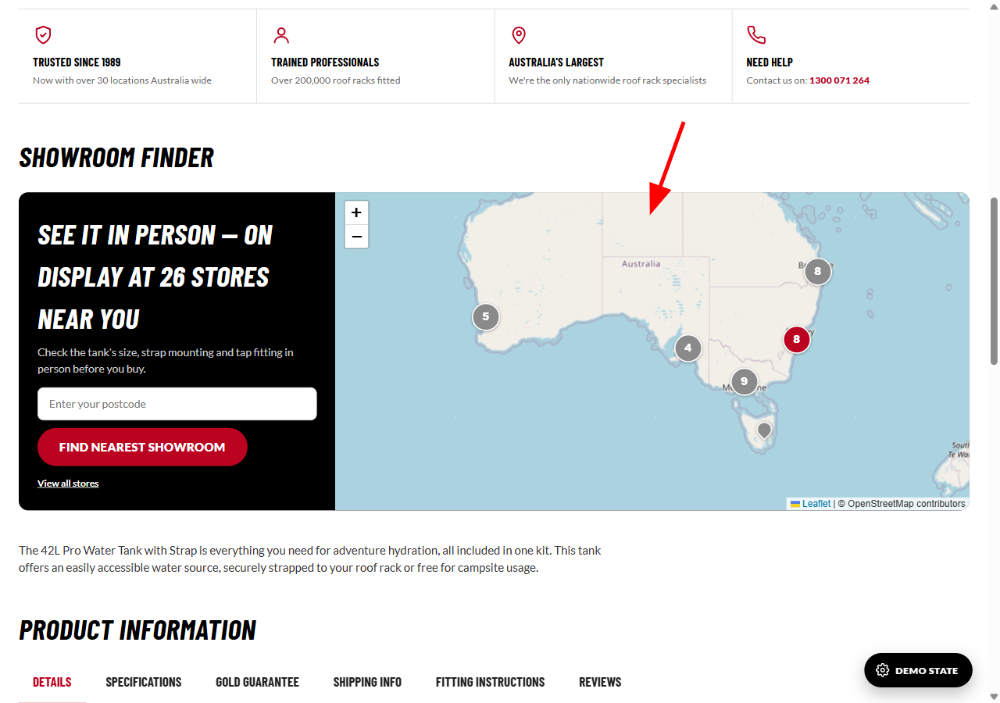
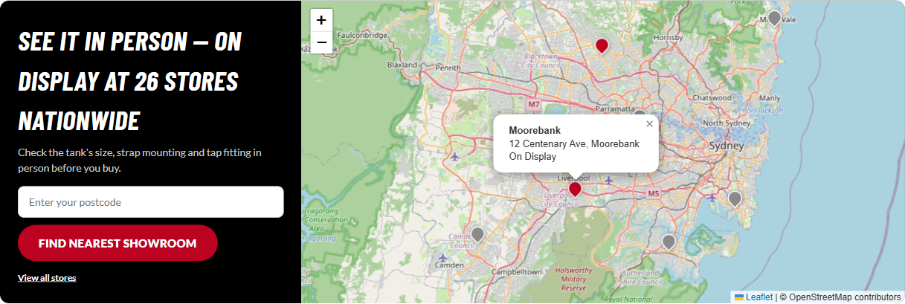
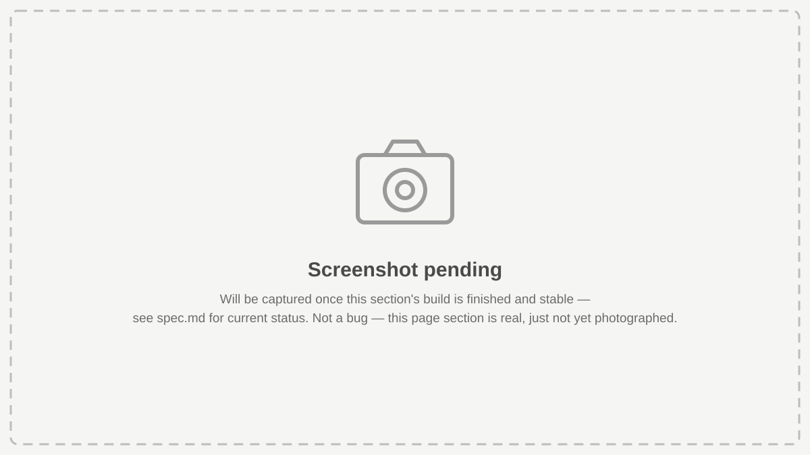

# Developer Brief — PDP Rebuild Handover

**Audience:** the internal developer building the real Magento 2 product page templates.
**Source design:** the static HTML/CSS/JS prototypes in `prototypes/` (this repo). This brief is the bridge between "what the prototype does" and "what to build in Magento" — it explains *why* each piece works the way it does, not just what it looks like, so implementation decisions in Magento can stay consistent with the intent even where the exact code can't be lifted verbatim.

## 0. How to use this document

- This is a **living document**, not a one-time export. It gets a new section (or an update to an existing one) whenever a feature is finalized in the prototype and ready to hand over — not necessarily every prototype change, only ones relevant to the real build.
- Every time this file changes, that change is also noted in `spec.md` (see its "Developer Brief" section) so anyone reading the project history knows this document moved.
- Where a feature is a **plain copy-paste external integration** (a vendor script tag, a widget embed), this brief gives you the exact, current, working code block used in the prototype — drop it into the Magento template as-is, then adjust only the values called out as per-product (typically the SKU).
- Where a feature is **custom-built** (no vendor code, hand-rolled against the prototype's own CSS/JS conventions), this brief explains the logic and gives you the source so you can port it into Magento's own JS/template structure rather than copy-pasting verbatim (the prototype's `shared.js`/`shared.css` aren't part of the Magento build).
- Screenshots show **where** something sits on the page and **what it looks like in its real, current state** — not mockups. Where a feature currently shows an empty/placeholder-like state because of real data gaps (e.g. no reviews exist yet against a SKU), that's called out explicitly so it isn't mistaken for a bug.
- **Screenshots are captured in one pass, at the very end, once every template is 100% complete and ready to hand over — not per section, and not once individual sections settle.** Confirmed 2026-09-11 (tightened same day from an earlier "per-section, once stable" version — see 0.1 rule 2). Reasoning: a screenshot of one finished widget can still have an unfinished widget sitting right next to it in frame, or the page around it can shift again before the whole template is done — so "this section is done" isn't actually a safe point to shoot from. **This applies retroactively too:** every screenshot currently in this document (Sections 2 and 3, both real captures) is provisional and will need to be redone in that final pass, even though nothing about those two sections themselves is expected to change — the point is a single consistent, final-state image set for Mark to work from, not a growing patchwork of "true when captured" snapshots from different points in the build.
- For the full page-by-page component reference (every section/widget by name), see `PAGE-GLOSSARY.md`. For the project's business requirements and build history, see `spec.md`. This brief only covers pieces that are finalized enough to hand over — check `spec.md` Section 10 for what's still in progress.

### 0.1 Rules for every section in this document

These rules apply to every widget/section written up in this brief from now on:

1. **Write it simply.** Plain English, short sentences. No jargon, no assumed technical background — a junior developer or a non-technical stakeholder should be able to follow it.
2. **Screenshots are mandatory, for every state — but only captured once the entire page is complete, not per section.** Every widget/section still needs a screenshot for each visual state/variant it can appear in (e.g. empty vs. populated, in stock vs. special order, hidden vs. shown), with at least one showing the **whole page** with a **red arrow** pointing at the widget. **Added 2026-09-11, tightened later the same day:** the first version of this rule said "once that section's build is stable" — Brenton corrected that: a section can be individually finished while a widget right next to it in the same frame still isn't, so a per-section screenshot can still show unfinished neighbours or shift again before the page as a whole settles. **The real rule: hold every screenshot in this entire document until all 5 templates are 100% complete and ready to hand over, then capture the whole set in one final pass** — this applies even to sections whose own build finished earlier. Until then, use `dev-brief-assets/screenshot-pending.svg` in place of every real screenshot and say so plainly (see Section 4 for the pattern) — the written spec (tables, data, code) can and should still be filled in ahead of that, only the visual proof waits.
3. **Every section covers at minimum three things, each its own labeled line:**
   - **Name** — what it's called (match `PAGE-GLOSSARY.md` naming where possible).
   - **Location** — where on the page it sits, in plain terms (e.g. "under the title, above the price").
   - **Purpose** — why it's there / what problem it solves, in one or two plain sentences.

Use this as the section template going forward:

```
### N. [Widget/Section Name]

**Location:** [where it sits on the page, plain English]

**Purpose:** [why it exists, one or two plain sentences]

**States:**
- [State 1 name] — [screenshot with red arrow showing location]
- [State 2 name] — [screenshot]
...

[Code / implementation notes, if any]
```

## 1. Project context

RRG's current live PDP is being rebuilt from scratch for conversion (not a re-skin) across four product-type templates: Simple, Config-Variant, Sibling/Color, Vehicle-Specific, plus a fifth Grouped/Bundle variant. Full rationale is in `spec.md` Section 0. The prototypes are plain HTML/CSS/JS specifically so they're fast to iterate on visually before committing to the real Magento 2 template work — they are **not** the production codebase, but every visual/behavioral decision in them is final unless `spec.md` flags it as still open.

Live prototype files (open directly, or via `prototypes/index.html` as a menu):
- `prototypes/simple/index.html`
- `prototypes/config-variant/index.html`
- `prototypes/sibling-color/index.html`
- `prototypes/vehicle-specific/index.html`
- `prototypes/grouped-bundle/index.html`
- `prototypes/_shared/shared.css` + `shared.js` — the component library all five import

---

## 2. REVIEWS.io Integration

> 📷 **Screenshots below are real captures from 2026-09-11 and still accurate** — but will be **recaptured anyway** in the single final screenshot pass once all 5 templates are 100% complete (see 0.1 rule 2). Nothing about this integration itself is expected to change; this is just so every image in the document comes from the same final pass, not a mix of dates.

Two separate pieces, built 2026-09-11, both driven by RRG's real REVIEWS.io account (`store: 'roof-racks-galore'`) — no mock/fake review data anywhere in either piece. Both pull from the **same underlying data** (this specific product's reviews) but are visually and technically independent — the badge does not embed or depend on the tab widget.

### 2.1 Reviews tab (Polaris widget)

**Name:** Reviews tab (REVIEWS.io Polaris widget)

**Location:** the last tab in the row of tabs near the bottom of the page (Details / Specifications / Gold Guarantee / Shipping Info / Fitting Instructions / **Reviews**), on all 5 templates. Click it to open the panel shown below.

**Purpose:** shows this product's customer reviews (star rating, written reviews, photos) so shoppers can see what other buyers thought before purchasing. Reviews with 5+ ratings are shown to lift conversion significantly on higher-priced items (see `spec.md` Section 0.1.3), so this needs to stay easy to find, not buried.

**States:**
- **Location on the page, tab opened** (red arrow shows where to click):
  
- **Current real state** — Front Runner Water Tank, `FRWTAN063`, no reviews against this SKU yet on the live account:
  
- **Once a product has real reviews** (genuine screenshot of the same widget pulling RRG's actual company reviews, shown to illustrate the populated layout — not this SKU's real content):
  

#### Code snippet (copy-paste)

This is the exact, current, working block from `prototypes/simple/index.html`. Drop the `<script src>` tag, the `<div id="ReviewsWidget">`, and the config `<script>` into the Reviews tab panel's markup. **Only `product_review.sku` and `questions.grouping` need to change per product** — everything else is shared config and brand styling, identical across all 5 templates.

```html
<script src="https://widget.reviews.io/polaris/build.js"></script>
<div id="ReviewsWidget"></div>
<script>
new ReviewsWidget('#ReviewsWidget', {
  store: 'roof-racks-galore',
  widget: 'polaris',
  options: {
    types: 'product_review,store_review',
    enable_sentiment_analysis: true,
    lang: 'en',
    layout: '',
    per_page: 15,
    store_review: { hide_if_no_results: false },
    third_party_review: { hide_if_no_results: false },
    product_review: { sku: 'FRWTAN063', hide_if_no_results: false },
    questions: {
      hide_if_no_results: true,
      enable_ask_question: true,
      enable_ask_question_button_style: false,
      show_dates: true,
      include_qna_structured_data: true,
      grouping: 'FRWTAN063'
    },
    header: {
      enable_summary: true,
      enable_ratings: true,
      enable_attributes: true,
      enable_image_gallery: true,
      enable_percent_recommended: false,
      enable_write_review: true,
      enable_ask_question: true,
      enable_sub_header: true,
      rating_decimal_places: 2,
      use_write_review_button: false,
      enable_if_no_results: false,
      show_review_title_field: false
    },
    sentiment: { badge_text: 'Our Customers Say', enable_rating_breakdown: false },
    filtering: {
      enable: true,
      enable_text_search: true,
      enable_sorting: true,
      enable_product_filter: false,
      enable_media_filter: true,
      enable_overall_rating_filter: true,
      enable_language_filter: false,
      enable_language_filter_language_change: false,
      enable_ratings_filters: true,
      enable_attributes_filters: true,
      enable_expanded_filters: false
    },
    reviews: {
      enable_avatar: true,
      enable_reviewer_name: true,
      enable_reviewer_address: true,
      reviewer_address_format: 'city, country',
      enable_verified_badge: true,
      verified_badge_position: '',
      enable_subscriber_badge: true,
      review_content_filter: 'all',
      enable_reviewer_recommends: true,
      enable_attributes: true,
      enable_product_name: true,
      enable_link_product: true,
      enable_review_title: true,
      enable_replies: true,
      enable_images: true,
      enable_ratings: true,
      enable_share: true,
      enable_helpful_vote: true,
      enable_helpful_display: true,
      enable_report: true,
      enable_date: true,
      date_format: undefined,
      date_location: undefined,
      enable_third_party_source: true,
      enable_duplicate_reviews: undefined,
      combine_title_stars: true,
      show_untranslated: false
    }
  },
  translations: { 'Verified Customer': 'Verified Customer' },
  styles: {
    '--base-font-size': '16px',
    '--common-button-font-family': 'inherit',
    '--common-button-font-size': '16px',
    '--common-button-font-weight': '700',
    '--common-button-letter-spacing': '0',
    '--common-button-text-transform': 'none',
    '--common-button-vertical-padding': '10px',
    '--common-button-horizontal-padding': '20px',
    '--common-button-border-width': '2px',
    '--common-button-border-radius': '4px',
    '--primary-button-bg-color': '#BB0220',
    '--primary-button-border-color': '#BB0220',
    '--primary-button-text-color': '#ffffff',
    '--secondary-button-bg-color': 'transparent',
    '--secondary-button-border-color': '#0E1311',
    '--secondary-button-text-color': '#0E1311',
    '--common-star-color': '#E8A83C',
    '--common-star-disabled-color': 'rgba(0,0,0,0.2)',
    '--medium-star-size': '22px',
    '--small-star-size': '19px',
    '--heading-text-color': '#0E1311',
    '--heading-text-font-weight': '700',
    '--heading-text-font-family': "'Barlow Condensed', sans-serif",
    '--heading-text-line-height': '1.3',
    '--heading-text-letter-spacing': '0',
    '--heading-text-transform': 'none',
    '--body-text-color': '#0E1311',
    '--body-text-font-weight': '400',
    '--body-text-font-family': 'inherit',
    '--body-text-line-height': '1.4',
    '--body-text-letter-spacing': '0',
    '--body-text-transform': 'none',
    '--pagination-tab-active-border-color': '#BB0220',
    '--pagination-tab-active-text-color': '#BB0220',
    '--sentiment-pagination-tab-active-border-color': '#BB0220',
    '--sentiment-pagination-tab-active-text-color': '#BB0220',
    '--sentiment-common-star-color': '#E8A83C'
  }
});
</script>
```

#### Per-template SKU values

The `sku` field takes a semicolon-separated list. Where a product has variants/colours that are each their own SKU on the live site, **all of them are listed together** so the widget shows reviews regardless of which variant a shopper has selected — the widget is not re-initialized when a variant/colour selector changes, it's set once on page load with the full family.

| Template | `product_review.sku` value |
|---|---|
| Simple (Water Tank) | `FRWTAN063` |
| Config-Variant (Pioneer 6 Platform) | `RH62112;RH62112F` |
| Sibling-Color (MaxTrax MKII, 13 colours) | `MTX02BK;MTX02MA;MTX02GG;MTX02FJB;MTX02LG;MTX02BY;MTX02PK;MTX02FJR;MTX02TG;MTX02DT;MTX02TQ;MTX02OD;MTX02SO` |
| Vehicle-Specific (Hilux N80 kit) | `GP01M1TZZ;GP01M1TZZF` |
| Grouped-Bundle (Yakima RoadShower) | `8004109PROMO` |

For a real Magento product page, generate this list dynamically from the product's configurable/sibling SKUs rather than hardcoding it — the semicolon-joined string is all the widget needs.

#### Config decisions worth knowing

- **`types: 'product_review,store_review'`** — this single line is what makes the widget render its own native Product/Company reviews tabs internally. An earlier prototype build hand-rolled a custom pill toggle for this before this real widget config was supplied; that custom code no longer exists, don't recreate it.
- **`hide_if_no_results: false`** on `product_review` and `store_review` — deliberately **not** the REVIEWS.io default (which is `true`). With `true`, a SKU with zero reviews renders nothing at all, which looks like the integration is broken. With `false`, the widget shows its real "No reviews collected for this product yet — Be the first to write a review" state instead — honest, correctly branded, and exactly what's in the first screenshot above. Keep this `false` in production too, for the same reason.
- **`styles` colour variables** were retinted from REVIEWS.io's neutral black/grey defaults to RRG's actual brand colours: `#BB0220` (brand red) for primary buttons and active pagination state, `#E8A83C` (amber/gold) for stars, `'Barlow Condensed'` for headings, matching the rest of the page.
- No API key is required — this widget is a public client-side embed tied to the `store` slug only.

---

### 2.2 Decision Panel star-rating badge (custom-built)

**Name:** Decision Panel star-rating badge

**Location:** directly under the title/value-prop line, above the price, in the box on the right-hand side of the page (the "Decision Panel") — on all 5 templates.

**Purpose:** gives shoppers a quick, at-a-glance star rating right next to the price, without having to scroll down and open the Reviews tab. Same reasoning as the Reviews tab above — reviews visible near the top of the page lift conversion.

**States:**
- **Location on the page** (red arrow shows where it sits, shown here with example review data so the badge is visible):
  
- **Current default state** — hidden, because none of this prototype's demo SKUs have real reviews yet (same underlying data gap as the Reviews tab above):
  
- **Once a product has real reviews** (illustrative — real markup and styling, mocked numbers to show the populated layout):
  

#### Why this is custom-built, not a REVIEWS.io widget

REVIEWS.io's product library doesn't include a small standalone "rating badge" widget for this compact above-the-fold placement — their smallest widget is still the full Polaris review-list widget used in the tab above. So this badge is hand-built, but it pulls from the **same real REVIEWS.io data** the Polaris widget itself uses: the identical `api.reviews.io/timeline/data` endpoint, confirmed via network inspection to be the actual call the Polaris widget makes internally, and confirmed CORS-open (safe to call directly from any origin — it's designed to be embedded on arbitrary merchant storefronts).

#### HTML markup

Add `data-review-sku` (same semicolon-separated SKU list as the tab widget above) to the existing star-rating strip, and wrap the two dynamic pieces (stars, text) so the script below can target them:

```html
<div class="reviews-strip" data-review-sku="FRWTAN063">
  <span class="stars" data-stars>★★★★★</span>
  <span data-review-text>4.5+</span>
  <a href="#reviewsTab" data-jump-tab="reviewsTab">See reviews</a>
</div>
```

(`data-jump-tab` is this prototype's own mechanism for making the "See reviews" link switch to the Reviews tab and scroll to it — port the *intent*, not necessarily this exact attribute, into whatever tab-switching approach the Magento template uses.)

#### CSS

```css
.stars{color:#E8A83C;letter-spacing:1px;font-size:15px;}
.stars .stars-empty{opacity:.35;}
```

#### JavaScript

```js
// Calls the same api.reviews.io/timeline/data endpoint the REVIEWS.io Polaris widget uses
// internally (per_page=1 since only the review-count/average summary is needed, not the
// review list itself). Deliberately does NOT fall back to the store's company-wide rating
// when a product has zero reviews — on an individual product page, showing a company-wide
// figure next to one specific product would read as that product's own rating and mislead
// the customer, even though the number itself is real. No product reviews yet = hide the
// whole badge, same as a fetch failure or the account having no data at all.
function initReviewSummary(root = document) {
  root.querySelectorAll('.reviews-strip[data-review-sku]').forEach(async strip => {
    const sku = strip.dataset.reviewSku;
    const starsEl = strip.querySelector('[data-stars]');
    const textEl = strip.querySelector('[data-review-text]');
    if (!starsEl || !textEl) return;
    try {
      const url = `https://api.reviews.io/timeline/data?type=product_review&store=roof-racks-galore&per_page=1&sku=${encodeURIComponent(sku)}&lang=en`;
      const res = await fetch(url);
      const data = await res.json();
      const avg = parseFloat(data.stats?.average_rating || '0');
      const count = data.stats?.review_count || 0;
      if (!count) { strip.hidden = true; return; }
      const filled = Math.round(avg);
      starsEl.innerHTML = '★'.repeat(filled) + `<span class="stars-empty">${'★'.repeat(5 - filled)}</span>`;
      textEl.textContent = `${avg.toFixed(1)} (${count.toLocaleString()} reviews)`;
    } catch (e) {
      strip.hidden = true;
    }
  });
}

// Call once on page load, e.g.:
document.addEventListener('DOMContentLoaded', () => initReviewSummary());
```

Same SKU-list table as Section 2.1 applies here — use the identical `data-review-sku` value as that template's `product_review.sku`.

#### Behavior summary

| Condition | Result |
|---|---|
| SKU has ≥1 real product review | Shows real rounded star rating + `"{avg} ({count} reviews)"`, links to Reviews tab |
| SKU has 0 real product reviews | Badge is hidden entirely (no fallback to company-wide rating — see rationale above) |
| API call fails (network error, etc.) | Badge is hidden entirely |

---

### 2.3 Before this leaves prototype stage

- None of this prototype's demo SKUs have real REVIEWS.io reviews yet, so both pieces currently show their "no data" states on every template. This is expected and will resolve itself once real reviews exist against real SKUs — nothing to fix.
- Confirm with REVIEWS.io / Tim whether the `roof-racks-galore` store slug and API usage shown here (direct `fetch` calls to `api.reviews.io` from custom code, not just the vendor's own widget script) fall within their terms of service for this kind of lightweight custom integration — it's a public, unauthenticated, CORS-open endpoint, but it's not an officially documented/supported API surface the way the Polaris widget itself is.
- Generate the SKU list dynamically from the real product/configurable-child data in Magento rather than hardcoding it, unlike this static prototype.

---

## 3. Showroom Finder interactive map

> 📷 **Screenshots below are real captures from 2026-09-11 and still accurate for AU** — but will be **recaptured anyway** in the single final screenshot pass once all 5 templates are 100% complete (see 0.1 rule 2), same as Section 2. Note the AU-only heading copy this section documents changes per region once Section 4's region work is built (see this section's own "Region-specific heading copy" note below) — worth re-checking against Section 4 at that final pass, not just re-shooting the same shot.

**Name:** Showroom Finder map (`#showroomMap`)

**Location:** inside the black "Showroom Finder" block, below the hero and Trust Row, on all 5 templates. The block splits into two columns on desktop (postcode search on the left, map on the right, roughly a third/two-thirds split) and stacks on mobile.

**Purpose:** shows shoppers the real size of RRG's store network at a glance and, more importantly, which of those stores currently have this exact product set up on display so they can check fit/finish in person before buying. A map with all 35 real stores (not just the 2 nearest) is deliberate — it communicates "we're a large nationwide network," not a small chain, even for stores that don't have this specific item on display.

**States:**
- **Location on the page, default zoomed-out view** (red arrow shows where it sits):
  
- **Zoomed in — pins split apart, popup open on a red (on-display) pin**:
  

Built 2026-09-10 (Leaflet + OpenStreetMap, piloted then rolled out to all 5 templates), reworked 2026-09-11 (backlog item 22) to add clustering, colour-coded pins, and a zoomed-out default view.

#### Why this is custom-built, not a vendor widget

There's no off-the-shelf "store locator" SaaS widget in use here — this is plain Leaflet (a free, open-source mapping library, no API key) plus OpenStreetMap tiles (free) plus one plugin, Leaflet.markercluster, for the pin-grouping behaviour. All three are loaded via CDN `<script>`/`<link>` tags; the logic that plots pins, colours them, and sets the default view is hand-written in `shared.js` and needs to be ported into the Magento template's own JS, not copy-pasted verbatim (it depends on this prototype's shared store-data array).

#### CDN tags (copy-paste, goes in `<head>`)

```html
<link rel="stylesheet" href="https://unpkg.com/leaflet@1.9.4/dist/leaflet.css">
<script src="https://unpkg.com/leaflet@1.9.4/dist/leaflet.js" defer></script>
<link rel="stylesheet" href="https://unpkg.com/leaflet.markercluster@1.5.3/dist/MarkerCluster.css">
<link rel="stylesheet" href="https://unpkg.com/leaflet.markercluster@1.5.3/dist/MarkerCluster.Default.css">
<script src="https://unpkg.com/leaflet.markercluster@1.5.3/dist/leaflet.markercluster.js" defer></script>
```

#### Store data needed

Every store needs a `lat`/`lng` in addition to the name/address/phone already used elsewhere on the page (Click & Collect widget, store slide-out). In this prototype that's `RRG_STORE_NETWORK` in `shared.js` — in Magento, whatever the real store/location data source is (a CMS store-locator table, a custom attribute set, etc.) needs to carry real geocoded coordinates for this to work. **This prototype's coordinates are demo-precision only** — approximate suburb-centre points, not geocoded from the real street addresses — so don't carry them over as-is; geocode the real addresses when this is built for real.

Separately, whatever marks a store as having this specific product **on display** (a boolean per store, per product — in this prototype, `ON_DISPLAY_STORES`, a flat placeholder list, not per-product) needs a real data source before this leaves prototype stage. See `spec.md` Section 10's scope note: the actual backend trigger for a genuine on-display flag is being handled separately (Rackety bin-location work), out of this project's scope — this page only needs to *read* that flag once it exists.

#### JavaScript — plotting the pins

```js
function rrgPinIcon(onDisplay) {
  return L.divIcon({
    className: `rrg-map-pin${onDisplay ? ' on-display' : ''}`,
    html: '<span></span>',
    iconSize: [22, 22],
    iconAnchor: [11, 22],
    popupAnchor: [0, -20]
  });
}

function rrgClusterIcon(cluster) {
  const markers = cluster.getAllChildMarkers();
  const hasDisplay = markers.some(m => m.options.rrgOnDisplay);
  return L.divIcon({
    className: `rrg-map-cluster${hasDisplay ? ' on-display' : ''}`,
    html: `<span>${cluster.getChildCount()}</span>`,
    iconSize: [36, 36]
  });
}

const map = L.map(mapEl);
L.tileLayer('https://{s}.tile.openstreetmap.org/{z}/{x}/{y}.png', {
  attribution: '&copy; OpenStreetMap contributors',
  maxZoom: 18
}).addTo(map);

const clusterGroup = L.markerClusterGroup({ iconCreateFunction: rrgClusterIcon, maxClusterRadius: 60 });
const latLngs = [];
allStores.forEach(s => {
  const onDisplay = storeIsOnDisplay(s); // real per-store/per-product check goes here
  L.marker([s.lat, s.lng], { icon: rrgPinIcon(onDisplay), rrgOnDisplay: onDisplay })
    .bindPopup(`<strong>${s.name}</strong><br>${s.street}, ${s.city}<br>${onDisplay ? 'On Display' : 'In-store stock varies'}`)
    .addTo(clusterGroup);
  latLngs.push([s.lat, s.lng]);
});
clusterGroup.addTo(map);
map.fitBounds(L.latLngBounds(latLngs), { padding: [24, 24] });
```

`fitBounds()` is what gives the zoomed-out, whole-country default view — it calculates the right zoom level and centre point to fit every pin on screen, rather than a hardcoded zoom/centre.

#### CSS — pin and cluster colours

```css
.rrg-map-pin span{display:block;width:20px;height:20px;border-radius:50% 50% 50% 0;transform:rotate(-45deg);background:#8a8a8a;border:2px solid #fff;box-shadow:0 1px 4px rgba(0,0,0,.4);}
.rrg-map-pin.on-display span{background:#BB0220;}
.rrg-map-cluster{display:flex;align-items:center;justify-content:center;}
.rrg-map-cluster span{display:flex;align-items:center;justify-content:center;width:36px;height:36px;border-radius:50%;background:#8a8a8a;color:#fff;font-weight:800;font-size:13px;border:2px solid #fff;box-shadow:0 1px 4px rgba(0,0,0,.4);}
.rrg-map-cluster.on-display span{background:#BB0220;}
```

Pins and cluster bubbles use hand-drawn CSS shapes (`L.divIcon`), not image files — no marker-icon assets to manage. Grey (`#8a8a8a`) is the default for a store without this product on display; `#BB0220` (brand red) marks a store that has it, for both individual pins and clusters. A cluster renders red the moment **any** store inside it is on display, so that signal is visible before a viewer zooms in — confirmed as the preferred approach over a single flat cluster colour or Leaflet.markercluster's default green/yellow/orange scheme.

#### Behavior summary

| Situation | Behaviour |
|---|---|
| Page loads, widget scrolls near viewport | Map initializes lazily (not on page load) for mobile data/performance reasons — see `spec.md` Section 10's mobile-audit note |
| Default view | Zoomed out to fit all stores in view (`fitBounds`), not centred on any one region |
| Many stores close together at low zoom | Grouped into one numbered cluster bubble; red if any store inside has the product on display, grey otherwise |
| User zooms in | Clusters split apart automatically (click a cluster to zoom into it directly) until individual pins show |
| Clicking a pin | Opens a popup with the store's real name, street address, and On Display / not status |

#### Region-specific heading copy

The black block's own heading (`<h3>` above the map, e.g. "See It In Person — On Display At 26 Stores Nationwide") is per-template static markup for AU, and swaps automatically for NZ/UK once the Region Selector is used — **built, see Section 4**. Full detail (copy table, map behaviour, screenshots) now lives there; this note is kept here only as a pointer since it sits right next to the map code above.

#### Before this leaves prototype stage

- Pin coordinates are demo-precision (approximate suburb centres) — geocode the real store addresses for production.
- The on-display flag per store is still a flat placeholder list, not driven by real per-product/per-store data — this is explicitly out of this project's scope (Brenton's own follow-up on the Rackety bin-location side); this widget just needs to read whatever boolean that work produces.
- Real postcode-driven search (typing a postcode and having the map re-centre/filter to nearby stores) isn't implemented — the postcode field in the black block still just informs the "View all stores" copy, not the map itself.
- Heading copy is AU-only today (see "Region-specific heading copy" above) — needs the NZ/UK variants once the region selector exists.

---

## 4. Region Selector & Multi-Region Support

> ⚠️ **Build status: confirmed, in progress — not fully live in the prototype yet.** The dropdown mechanics (4.1) and the UK brand-skin colour/logo/currency swap (4.3) are built and working today. Everything in 4.2's cascade table, plus the store/contact data (4.4) and UK payment-provider differences (4.5), reflect **corrected, client-confirmed values that still need to be wired into the prototype** — see `spec.md` Section 10.D, items 27–34, for the live build checklist. Don't assume any specific detail below is already on the page without checking that list first.
>
> **Screenshots are placeholders for this whole section**, on purpose — see 4.6. Real screenshots for this section (and for the whole document — see 0.1 rule 2) are captured in one final pass once **all 5 templates are 100% complete and ready to hand over**, not once items 27–33 alone are done.

**Name:** Region Selector

**Location:** top-right of the header's Utility Bar (the blue/red band above the main header), next to "Call Us" — a flag + country name button (e.g. "🇦🇺 Australia"), on all 5 templates.

**Purpose:** lets a reviewer preview how the page would look for RRG's other markets without needing separate page builds. Clicking a region live-swaps copy, currency, map/store data, and (for UK) the whole brand skin — no page reload. **This is a prototype-review tool that previews a future capability, not a finished customer-facing feature** — RRG doesn't currently sell in NZ/UK the way this control implies; see "Before this leaves prototype stage" below.

**States:**
- **Closed, default (AU)** — red arrow shows where to click:
  
- **Open, showing all 3 options:**
  
- **AU selected (default on load)** — whole page:
  
- **NZ selected** — RRG branding stays, Delivery becomes the default tab, Trust Row/Showroom Finder copy and contact details change — whole page:
  
- **UK selected** — full brand skin change on top of the NZ-style cascade, plus its own payment-provider set — whole page:
  

### 4.1 How the dropdown works

Same open/close interaction pattern already used elsewhere on the page for the "Products" template-switcher menu: click the button to open a menu, click outside (or pick an option) to close it. No page reload — picking a region calls one JS function, `applyRegion(region)`, which re-renders everything listed in the cascade table below.

```html
<div class="region-switcher u-item">
  <button type="button" class="region-switcher-toggle" aria-haspopup="true" aria-expanded="false">
    <span class="flag-emoji" data-region-flag>🇦🇺</span> <span data-region-label>Australia</span>
    <svg viewBox="0 0 24 24" ...><path d="M6 9l6 6 6-6"/></svg>
  </button>
  <div class="region-switcher-menu">
    <span class="tsm-label">Region</span>
    <a href="#" data-region="AU" class="current"><span class="flag-emoji">🇦🇺</span> Australia</a>
    <a href="#" data-region="NZ"><span class="flag-emoji">🇳🇿</span> New Zealand</a>
    <a href="#" data-region="UK"><span class="flag-emoji">🇬🇧</span> United Kingdom</a>
  </div>
</div>
```

**Important:** the page always starts on AU, every time it loads — the selected region is **not** saved anywhere (no cookie, no localStorage, no server session). This matches every other reviewer-toggle in this prototype (the Demo State Panel). A real Magento build would decide region a different way entirely (domain/subdomain, a real customer/session setting, geo-IP) — this dropdown is a prototype-only stand-in for whatever that real mechanism ends up being, not a pattern to port as-is.

### 4.2 Per-widget region cascade

One region change touches eleven separate things on the page. Each is independent — build them as small "does this widget care about region" hooks rather than one monolithic function, same as this prototype's `applyRegion()` does internally (see below for the actual function, provided for logic reference — it depends on this prototype's own DOM/helper functions, so port the *behaviour* below, not the code verbatim). **Rows 9–11 are new/corrected 2026-09-11 and are not built yet** (see the status banner above) — everything else in this table matches the prototype's real, already-working behaviour.

| # | What changes | AU (default) | NZ | UK |
|---|---|---|---|---|
| 1 | Utility bar trigger (flag + label) | 🇦🇺 Australia | 🇳🇿 New Zealand | 🇬🇧 United Kingdom |
| 2 | Delivery/Click & Collect widget — default active tab | Click & Collect | Delivery | Click & Collect |
| 3 | Delivery/Click & Collect widget — "View all stores" link | Shown (real 35-store AU list) | Hidden (no real store list for this region) | Hidden |
| 4 | Showroom Finder heading | Real per-product AU copy, e.g. "On Display At 26 Stores Nationwide" | "On Display At the Auckland Store" | "On Display At the **Bolton** Store" *(corrected — was "London," see 4.4)* |
| 5 | Showroom Finder map | Zoomed-out clustered view of all 35 real AU stores (see Section 3) | Zoomed to one pin, Auckland (demo-precision coordinates) | Zoomed to one pin, **Bolton** *(corrected — was London, see 4.4)* |
| 6 | Trust Row — "Trusted Since 1989" / "Australia's Largest" tiles | Real AU copy (unchanged) | "Trusted Since 1989" / "Visit In Person — Check it out at our Auckland showroom" | "Trusted Since 1989" / "Visit In Person — Check it out at our **Bolton** showroom" *(corrected — was London)* |
| 7 | Currency symbol on every price on the page | $ | $ | £ (same numeric value — **symbol swap only, no FX conversion anywhere in this prototype**) |
| 8 | Brand skin (logo, primary colour, Add to Cart colour) | RRG red/gold, RRG wordmark logo | Unchanged — NZ stays RRG-branded, no rebrand (real scraped copy already treats AU+NZ as one network under one brand) | **The Roof Box Company** navy/yellow branding, green Add to Cart — see 4.3 |
| 9 | **Trust Row phone number** ("Need Help" tile) — **not built yet** | `1300 071 264` (unchanged) | `09 481 1910` | `01204 899778` |
| 10 | **Payment badges under Add to Cart** — **not built yet**, see 4.5 | Afterpay + PayPal + Zip (Afterpay/PayPal "Pay in 4," Zip its own weekly copy) | Afterpay + PayPal only, "Pay in 4" (Zip dropped — not offered in NZ) | Full 3-provider swap, not a hide/show: **Clearpay** ("Pay in 4," same structure as Afterpay) + **PayPal** ("Pay in 3," not 4) + **Klarna** ("Pay in 3" over 3 months) |
| 11 | **Header utility bar "Your Nearest Store"** — **not built yet**, currently hardcoded AU text regardless of region | North Lakes (unchanged) | Auckland | Bolton |

Row 3's Showroom Finder equivalent (its own "View all stores" link) follows the same AU-only rule — both links use the identical real 35-store slide-out, which has no NZ/UK content to show.

**UK header/CTA/price, close up** (rows 1, 2, 6 [truncated below fold], 7, 8, 9, 10, 11 together):


**UK Showroom Finder, close up** (rows 4–5):


**NZ header/DC-tab, close up** (rows 1–2, 7 unchanged — still RRG branding/$; rows 9–10 once built):


**NZ Showroom Finder, close up** (rows 4–5):


#### JavaScript — the cascade function (reference, not copy-paste)

**The data values below are the corrected, client-confirmed ones (2026-09-11) — the live prototype's `shared.js` still has the old placeholder UK values (`London`, `51.5074, -0.1278`) and no `phone`/`address` fields at all.** Treat this block as the target to build toward, not a description of what's in the repo today.

```js
const REGION_LABELS = { AU: 'Australia', NZ: 'New Zealand', UK: 'United Kingdom' };
const REGION_FLAGS = { AU: '🇦🇺', NZ: '🇳🇿', UK: '🇬🇧' };
const REGION_DEFAULT_DC_TAB = { AU: 'collect', NZ: 'delivery', UK: 'collect' };

// Corrected 2026-09-11 — real addresses/phone numbers sourced from each brand's own live
// contact page (see 4.4). Coordinates are suburb/town-centre approximations, same
// demo-precision convention as the rest of this prototype's store data — not geocoded to
// the exact unit.
const REGION_SINGLE_STORES = {
  NZ: {
    name: 'Auckland',
    address: '195A Wairau Road, Wairau Valley, Auckland 0627',
    phone: '09 481 1910',
    lat: -36.7747, lng: 174.7381
  },
  UK: {
    name: 'Bolton',
    address: 'Unit B9, Edge Fold Industrial Estate, Plodder Lane, Farnworth, Bolton, BL4 0LR',
    phone: '01204 899778',
    lat: 53.5503, lng: -2.3882
  }
};

// Trust Row phone number, by region — NOT wired up yet (item 28); currently one static AU
// number (1300 071 264) regardless of selected region.
const REGION_PHONE = { AU: '1300 071 264', NZ: '09 481 1910', UK: '01204 899778' };

const REGION_TRUST_COPY = {
  AU: { founded: { h4: 'Trusted Since 1989', p: 'Now with over 30 locations Australia wide' },
        network: { h4: "Australia's Largest", p: "We're the only nationwide roof rack specialists" } },
  NZ: { founded: { h4: 'Trusted Since 1989', p: 'Now serving New Zealand' },
        network: { h4: 'Visit In Person', p: 'Check it out at our Auckland showroom' } },
  UK: { founded: { h4: 'Trusted Since 1989', p: 'Now serving the United Kingdom' },
        network: { h4: 'Visit In Person', p: 'Check it out at our Bolton showroom' } }
};

function applyRegion(region) {
  // 1. Trigger label/flag + which menu item shows as "current"
  // 2. Click the widget's own real tab button for REGION_DEFAULT_DC_TAB[region]
  //    (re-uses the existing tab-switch logic rather than duplicating it), then hide/show
  //    the "View all stores" link based on region === 'AU'
  // 3. Update the Showroom Finder <h3> — cache the real AU string the first time this runs
  //    (so switching back to AU restores the real per-product copy instead of a generic
  //    string), else show `On Display At the ${REGION_SINGLE_STORES[region].name} Store`
  // 4. Re-plot the map: AU = full 35-store clustered network; NZ/UK = a single marker at
  //    REGION_SINGLE_STORES[region], map zoomed/centred on it
  // 5. Swap Trust Row copy from REGION_TRUST_COPY[region]
  // 6. NOT BUILT YET — swap the Trust Row phone number/tel: link from REGION_PHONE[region]
  // 7. NOT BUILT YET — swap the header utility bar's "Your Nearest Store" text/link from
  //    REGION_SINGLE_STORES[region].name (AU keeps its own real nearest-store logic)
  // 8. NOT BUILT YET — swap the payment-badges provider set for UK (see 4.5); NZ's Zip
  //    removal is a simple hide, UK's Clearpay/PayPal-pay-in-3/Klarna is a full re-render
  // 9. Run the currency-symbol sweep (4.3)
  // 10. Run the brand-skin swap (4.3)
}
```

### 4.3 UK Brand Skin & Currency

RRG trades in the UK as a real sister brand, **The Roof Box Company** (`roofbox.co.uk`) — this isn't a fictional rebrand, it's a real business the prototype is previewing. Scope was deliberately limited: **logo + core colour only** — typography (Barlow Condensed/Lato) stays the same as the rest of the prototype, this is not a full re-skin.

#### Colour — CSS custom-property override (copy-paste)

Every component already built against the shared `--rrg-red`/`--rrg-red-dark` tokens (utility bar, links, tab underline, sale badges, map pins, etc.) recolours automatically — no per-component CSS needed. Add to Cart needed its own override since it's a separate locked-in gold default, not on the red token.

```css
body.region-uk{--rrg-red:#2E41AE;--rrg-red-dark:#1F2E82;}
body.region-uk [data-cta-label].btn-primary{background:#26B226;color:#fff;}
body.region-uk [data-cta-label].btn-primary:hover{background:#1e8f1e;}
```

```js
document.body.classList.toggle('region-uk', region === 'UK');
```

Colour values were read directly off the real live `roofbox.co.uk` site: navy (`#2E41AE`) and yellow (`#FFFF19`) from their logo SVG's own fill values, green (`#26B226`) from their live "Click Here To Order" button.

#### Logo

Straight `src`/`alt` swap on every `.rrg-logo img` on the page — the same markup pattern is reused for the main header and the sticky/condensed mobile header, so one swap covers both:

```js
const RRG_LOGO = { src: '../_shared/headerlogo.png', alt: 'Roof Racks Galore' };
const UK_LOGO = { src: '../_shared/brand-roofbox-uk-logo.svg', alt: 'The Roof Box Company' };
document.querySelectorAll('.rrg-logo img').forEach(img => {
  img.src = logo.src; // logo = region === 'UK' ? UK_LOGO : RRG_LOGO
  img.alt = logo.alt;
});
```

Real logo file: `prototypes/_shared/brand-roofbox-uk-logo.svg` (downloaded from `roofbox.co.uk/images/trbc_logo.svg`).

**Why the logo needs its own CSS, not just a swapped ``:** The Roof Box Company's real logo is a tall vertical rectangle (roughly square, ~0.82:1) where RRG's is a wide horizontal wordmark (~6.2:1) — dropped in at the same size/position as RRG's logo, it would look tiny and cramped. Client direction (from a supplied reference screenshot, `UK header example.png`, project root) was for the UK logo to visually **span both header bars** — bottom flush with the base of the white Main Header, top reaching roughly halfway up through the navy Utility Bar above it — on desktop, mobile, and the sticky/scrolled header alike. This needed real CSS positioning work (the logo is pulled out of normal layout flow and absolutely positioned against fixed pixel offsets specific to this prototype's own header heights), so **don't copy the CSS verbatim** — it's in `prototypes/_shared/shared.css` around line 265–310 (search `body.region-uk .rrg-logo`) as a worked reference for the *effect* to reproduce against Magento's own header markup/heights, not a drop-in rule. Two non-obvious things worth knowing if this gets re-built from scratch:
- An absolutely-positioned-only child collapses its parent's box to zero size — anchor the parent with `align-self:flex-start` (or the grid/flex equivalent), not `center`, or the logo silently sits in the wrong place.
- If the parent's width also collapses to 0, this project's own global `img{max-width:100%}` reset will clamp the image's own explicit width down to 0 too (100% of a 0-width container) — give the parent an explicit width matching the image's, not just the image itself.

#### Currency — symbol swap, no FX conversion

```js
function regionCurrencySymbol(region) { return region === 'UK' ? '£' : '$'; }
```

Every price-rendering function in the prototype (`fmtAud()` in shared.js, plus the 3 per-template `fmtMoney()` duplicates) calls this to pick the symbol on its next render. A second pass, `applyRegionCurrency(region)`, fixes whatever's *already* sitting in the DOM at the moment of switching (static per-SKU markup, Related Products price tags, payment-badge instalment text) by walking text nodes and swapping the symbol directly:

```js
function applyRegionCurrency(region) {
  const symbol = region === 'UK' ? '£' : '$';
  const walker = document.createTreeWalker(document.body, NodeFilter.SHOW_TEXT, {
    acceptNode(node) {
      if (!/[$£]\d/.test(node.nodeValue)) return NodeFilter.FILTER_SKIP;
      return node.parentElement && node.parentElement.closest('script, style, .admin-panel')
        ? NodeFilter.FILTER_REJECT : NodeFilter.FILTER_ACCEPT;
    }
  });
  const nodes = [];
  let n;
  while ((n = walker.nextNode())) nodes.push(n);
  nodes.forEach(node => { node.nodeValue = node.nodeValue.replace(/[$£](?=\d)/g, symbol); });
}
```

**This is a symbol swap only — the numbers themselves never change.** A £299.00 UK price is the same demo figure as the $299.00 AU price, not a real currency-converted one. A real Magento build needs real UK pricing (and, if the UK ever sells in GBP for real, a real FX/pricing strategy) behind this — the symbol-swap trick is prototype-only.

### 4.4 Region-specific store & contact data — not built yet

Three separate places on the page show a phone number and/or store name that should change with the selected region. None of this is wired into `applyRegion()` in the live prototype today — all three currently show fixed AU content (or, for the UK store, the wrong placeholder name) regardless of which region is selected.

| Where | AU (real, unchanged) | NZ | UK |
|---|---|---|---|
| Trust Row "Need Help" tile phone number | `1300 071 264` | `09 481 1910` | `01204 899778` |
| Header utility bar "Your Nearest Store" | North Lakes | Auckland | Bolton |
| Showroom Finder heading + Click & Collect "on display" line (both read the same underlying store name) | Real per-product AU store count | Auckland | **Bolton** — corrected 2026-09-11, was showing a placeholder "London" |

**Real NZ contact details** (Roof Racks Galore, Auckland — sourced 2026-09-11 from [roofracksgalore.co.nz/contact-us](https://roofracksgalore.co.nz/contact-us)):
- Address: 195A Wairau Road, Wairau Valley, Auckland 0627
- Phone: `09 481 1910`

**Real UK contact details** (The Roof Box Company, Manchester North Store — sourced 2026-09-11 from [roofbox.co.uk/locations/manchester-north.php](https://www.roofbox.co.uk/locations/manchester-north.php)):
- Address: Unit B9, Edge Fold Industrial Estate, Plodder Lane, Farnworth, Bolton, BL4 0LR
- Phone: `01204 899778`
- **The store's town is Bolton, not London** — the earlier placeholder ("London") was a fabricated guess made before this research was done. The listing itself is titled "Manchester North Store," but the actual town/postcode is Bolton — use "Bolton" as the region label shown to shoppers (matches items 4–6 in the cascade table), not "Manchester" or "Manchester North."

Both sets of coordinates in the code block above (4.2) are suburb/town-centre approximations for map-pin placement — same demo-precision convention as the rest of this prototype's store data, not geocoded to the exact street address.

### 4.5 UK payment provider differences — not built yet

The UK doesn't just hide/show a payment badge the way NZ does (NZ simply drops Zip, keeping Afterpay + PayPal as-is) — **the UK payment-badges row needs a full 3-provider swap**, confirmed 2026-09-11:

| Badge slot | AU / NZ | UK |
|---|---|---|
| 1st badge | Afterpay — "4 payments of $X" | **Clearpay** — same company as Afterpay (their UK/EU brand), same "Pay in 4" structure/copy, only the logo and label change: "4 payments of £X" |
| 2nd badge | PayPal — "4 payments of $X" | PayPal (same logo, unchanged) — but the UK product is **"Pay in 3,"** not "Pay in 4": copy changes to "3 payments of £X" (divide price by 3, not 4) |
| 3rd badge | Zip — weekly copy (AU only; dropped entirely for NZ, see 4.2 row 10) | **Klarna** — UK's "Pay in 3," spread over 3 months. This is a **different provider** from PayPal's own Pay in 3 above; both happen to land on 3 instalments, but keep them as two separate badges with their own logo/copy, don't merge or dedupe them |

**Real logo files, staged but not yet referenced by any template:**
- `prototypes/_shared/payment-logos/clearpay.svg` — official black wordmark, downloaded 2026-09-11 from Clearpay's own retailer marketing-resources page ([clearpay.co.uk/en-GB/for-retailers/resources/marketing/logos](https://www.clearpay.co.uk/en-GB/for-retailers/resources/marketing/logos) → wordmark package, Adobe Illustrator-exported SVG)
- `prototypes/_shared/payment-logos/klarna.svg` — official black wordmark, downloaded 2026-09-11 from Wikimedia Commons ([File:Klarna Logo black.svg](https://commons.wikimedia.org/wiki/File:Klarna_Logo_black.svg)) — Klarna doesn't have a self-serve brand-asset portal as directly scrapable as Clearpay's, so Commons was used instead; same general trademark-use caveat as any brand logo
- Existing `afterpay.svg`/`paypal.svg`/`zip.svg` in the same folder are unaffected and stay as-is for AU/NZ

When this gets built, follow the existing `.payment-badge`/`.pb-logo`/`.pb-text` markup pattern already in every template (see the existing 3-badge row in any template's HTML) — swap which 3 badges render based on `region`, rather than trying to reuse one fixed set of 3 DOM slots with conditional `src` swaps, since AU/NZ and UK don't share the same instalment-count math (÷4 vs ÷3) for their shared PayPal badge.

### 4.6 Why every image in this section is a placeholder

Every screenshot in this section is the generic "Screenshot pending" graphic, not a real capture — a deliberate choice, not an oversight. A real screenshot pass was done for this section on 2026-09-11, but Brenton caught real problems in it during review (an internal "Design Rationale" scratchpad section was visible at the bottom of every shot — see `spec.md` §10.D item 27 — and the UK store data baked into the screenshots was a fabricated placeholder, corrected in 4.4 above) before this section, or the wider set of outstanding PDP changes, had settled.

**The rule this led to (0.1 rule 2) is stricter than "wait for this section to be done":** screenshots for the *entire* document are held until **all 5 templates are 100% complete and ready to hand over**, then captured in one final pass — not per section, even once a given section's own build is finished. A section being individually done doesn't mean the frame around it in a screenshot is done — a neighbouring widget can still be mid-change, or the page can shift again before the whole template settles — so "this section is stable" was never actually a safe point to shoot from. The written spec (tables, data, code references) can and should still be filled in ahead of that final pass, as this section does — only the visual proof waits, for every section, until the very end.

### 4.7 Before this leaves prototype stage

- **NZ and UK are not real RRG store networks — this whole feature previews a hypothetical future, not a shipped capability.** RRG doesn't currently sell into NZ/UK as separate regions the way this dropdown implies (NZ is served as part of the AU network today; the UK sister brand, The Roof Box Company, trades independently and isn't integrated with RRG's systems). Confirm with the business whether/when a real region-aware storefront (real domain or session-based region detection, real UK pricing/stock, real per-region logistics) is actually wanted before treating this as a build spec rather than a design preview.
- **Trust Row NZ/UK copy is placeholder wording** ("Now serving New Zealand" etc.) — needs real client-approved copy, same caution as the rest of this project's placeholder content.
- **No real FX conversion exists anywhere** — if the UK ever needs real GBP pricing, that's a separate pricing/data feed decision, not something to build off the symbol-swap code in 4.3.
- Region selection resets on every page load by design (see 4.1) — don't add persistence without checking this is still wanted; it was a deliberate choice to match every other reviewer toggle in this prototype.
- The single-store coordinates for NZ/UK (4.2, 4.4) are town/suburb-centre approximations, not geocoded to the exact street address — same caveat as the rest of this project's store data.

---

*Sections are added here as more of the prototype gets finalized and handed over — this is not the full site brief yet. Check `spec.md`'s own "Developer Brief" note for the date of the last addition.*
